<!-- Generated by GitHub Profile Agent Console. Edit profile.config.json, then run npm run generate. -->

  <picture>
    <source media="(max-width: 760px) and (prefers-color-scheme: dark)" srcset="./assets/hero/agent-console-5b934825-mobile-dark.svg">
    <source media="(max-width: 760px)" srcset="./assets/hero/agent-console-5b934825-mobile-light.svg">
    <source media="(prefers-color-scheme: dark)" srcset="./assets/hero/agent-console-5b934825-dark.svg">
    <source media="(prefers-color-scheme: light)" srcset="./assets/hero/agent-console-5b934825-light.svg">
    
  </picture>

  
  
  

## About Me

I'm a Software Engineering student focused on designing and building reliable software. I enjoy turning ideas into practical applications while continuously improving my skills through academic and personal projects.

My interests include backend engineering, cloud technologies, software architecture, and AI. I value clean code, scalable solutions, and continuous learning by building projects that solve real-world problems.

## Current Focus

| Area | What I am exploring |
| --- | --- |
| **Backend Development** | Building secure and scalable APIs using modern frameworks and best practices. |
| **Cloud Computing** | Learning cloud-native technologies and designing resilient distributed systems. |
| **Software Architecture** | Designing maintainable applications with clean architecture and scalable patterns. |
| **Artificial Intelligence** | Exploring AI tools and intelligent systems to solve practical problems. |

## Featured Work

| Project | Focus | Why it matters |
| --- | --- | --- |
| [**Para Cálculo**](https://github.com/miikeepp/Para-Calculo) | Academic calculus support tool | A personal project built to support calculus practice and study, showing applied frontend fundamentals with React and TypeScript. [Live](https://para-calculo.vercel.app/) |
| [**Mentes Creativas**](https://github.com/AlejandroBast/MentesCreativas) | Collaborative creativity web app | Collaboration built during software engineering coursework, focused on creativity and teamwork using React and JavaScript. [Live](https://mentes-creativas.vercel.app/) |
| [**Tinck Cash**](https://github.com/AlejandroBast/EstructuraPatrones-front) | Design patterns & frontend structure | Collaborative frontend exercise applying software design patterns and clean code structure with React and TypeScript. [Live](https://estructura-patrones-front.vercel.app/inicio) |

## Research Direction

I focus on building software that is reliable, scalable, and maintainable. My goal is to deepen my expertise in backend engineering, cloud technologies, and software architecture while applying AI to create practical solutions for real-world challenges.

## Tech Stack

`TypeScript` · `JavaScript` · `Python` · `Java` · `SQL` · `React` · `Next.js` · `Node.js` · `Tailwind CSS` · `PostgreSQL` · `MongoDB` · `AWS` · `Docker` · `GitHub Actions` · `Git`

## Contributions

  <picture>
    <source media="(prefers-color-scheme: dark)" srcset="https://raw.githubusercontent.com/miikeepp/miikeepp/output/github-contribution-grid-snake-dark.svg">
    <source media="(prefers-color-scheme: light)" srcset="https://raw.githubusercontent.com/miikeepp/miikeepp/output/github-contribution-grid-snake.svg">
    
  </picture>

---

  Building reliable software, one project at a time.

